# Narrower Than Expected: Optimal Group Depth for Ethereum's Binary Trie

*Full interactive report with SVG diagrams: [GitHub Pages link pending]*

> **GD-5 is optimal.** We benchmarked seven binary trie group-depth configurations (GD-1 through GD-6, plus GD-8) on 360 GB databases with 400 million state entries. GD-5 delivers **11% faster writes** than GD-4 (p < 1e-9), **16% faster mixed workloads** (p < 1e-3), and competitive read throughput. The write optimum lies at 5 bits per node — one step beyond GD-4, but before rehashing costs explode at GD-6.

---

## S1 -- Executive Summary

The binary trie is on the [Ethereum protocol strawman](https://strawmap.org/) as a future state tree replacement. No binary trie implementation has been benchmarked at scale -- not group depth, not anything else. With this transition on the roadmap, assessing performance characteristics is a prerequisite for informed prototyping. The geth implementation ([EIP-7864](https://eips.ethereum.org/EIPS/eip-7864)) exposes a `--bintrie.groupdepth` parameter that controls how binary levels are packed into on-disk nodes; this study benchmarks seven configurations to determine the optimal setting.

> **Bottom line:** GD-5 is optimal -- 11% faster writes than GD-4 (p < 1e-9), 16% faster mixed workloads (p < 1e-3), and competitive read throughput. The write optimum lies at 5 bits per node.

### What we tested

Seven group-depth configurations (GD-1 through GD-6, plus GD-8) on identical 360 GB databases with ~400 million state entries. Five benchmark types -- two synthetic (raw SLOAD/SSTORE) and three ERC20 contract workloads -- each run 9 times under a cold-cache protocol. All results use medians with [Mann-Whitney U](https://en.wikipedia.org/wiki/Mann%E2%80%93Whitney_U_test) significance tests.

### What we found

- **Reads confirm the intuition** (S4): Wider trees read faster. GD-8 reads are 56% faster than GD-1, with GD-3 through GD-8 all within ~10% of each other by throughput.
- **Writes reveal a sharper optimum** (S5): GD-5 is the write champion at 601 ms -- 11% faster than GD-4 (678 ms) and 64% faster than GD-8 (982 ms). Beyond GD-5, rehashing costs explode.
- **The sweet spot is GD-5** (S6): GD-5 wins writes by 11% and mixed workloads by 16% over GD-4, with competitive read throughput (7.08 vs 5.46 Mgas/s).

### How to read this post

S2 Background covers the binary trie and group depth concept. S3 Methodology details the benchmark setup (collapsible). S4--S6 present the results in a narrative arc: reads, writes, then the trade-off. S7 Patterns examines cross-cutting observations, and S8 Conclusions gives the recommendation and open questions.

---

## S2 -- Background

### What is the Binary Trie?

EIP-7864 proposes replacing Ethereum's Merkle Patricia Trie (MPT) with a binary trie. The binary trie unifies the account trie and all storage tries into a single tree, uses SHA-256 for hashing instead of Keccak-256, and stores 32-byte stems that map to groups of 256 values. This design simplifies witness generation for stateless clients and enables more efficient proofs.

The transition from MPT to a binary trie is one of the most consequential changes to Ethereum's state layer. Performance characteristics of the new structure will directly affect block processing time, sync speed, and validator economics.

### What is Group Depth?

The trie is **always binary** at the fundamental level -- every internal node has exactly two children (left for bit 0, right for bit 1). Group depth controls how many binary levels are *bundled into a single on-disk node*. At GD-N, each stored node encapsulates an N-level binary subtree, so it *appears* to have 2^N children when viewed from the outside:

- **GD-1:** 1 binary level per node --> 2 child pointers, 256 nodes on the path to a leaf
- **GD-2:** 2 binary levels per node --> 4 child pointers, 128 nodes on path
- **GD-3:** 3 binary levels per node --> 8 child pointers, ~86 nodes on path
- **GD-4:** 4 binary levels per node --> 16 child pointers, 64 nodes on path
- **GD-5:** 5 binary levels per node --> 32 child pointers, ~52 nodes on path
- **GD-6:** 6 binary levels per node --> 64 child pointers, ~43 nodes on path
- **GD-8:** 8 binary levels per node --> 256 child pointers, 32 nodes on path

Think of it like a zip code: GD-1 reads your address one digit at a time (256 steps), while GD-8 reads 8 digits at once (32 steps). Fewer steps means fewer disk reads -- but each "bundled node" is larger and more expensive to update, because the binary subtree inside it must be rehashed.

<!-- Upload: diagrams/diagram_1_tree_shapes.png -->

*Figure 1 -- Tree shape at different group depths. Each node bundles N binary levels internally, reducing the number of on-disk nodes on the path to a leaf.*

The trade-off is straightforward in theory: reads benefit from shallow trees (fewer disk I/O operations to reach a leaf), while writes suffer from wide nodes (more internal hashing when a node is modified). The question is where the crossover point lies.

---

## S3 -- Methodology

<strong>Click to expand full methodology</strong>

### Benchmark Setup

| Parameter | Value |
|:----------|:------|
| Machine | QEMU VM -- 8 vCPUs, 30 GB RAM, 3.9 TB SSD, Ubuntu 24.04 LTS |
| Database | ~360 GB, ~400M accounts + storage slots |
| Configurations | GD-1, GD-2, GD-3, GD-4, GD-5, GD-6, GD-8 (Pebble, the LSM-tree storage engine used by geth, 4KB block size) |
| Protocol | Cold cache (OS page cache dropped + Pebble cache=0 between runs) |
| Runs | 10 per benchmark per config; run 1 excluded (residual warmth) |
| Gas target | 100M gas per block |

### Statistical Approach

- Per-run block medians aggregated across 9 retained runs
- **Mann-Whitney U test** for pairwise comparisons (non-parametric)
- Effect sizes reported as percentage difference from baseline (GD-1)
- Coefficient of variation (CV%) for consistency assessment

### Benchmark Taxonomy

**a) Synthetic benchmarks** -- `sstore_variants` (writes) and `sload_benchmark` (reads). These use EIP-7702 delegations with sequential storage slots. Keys are numerically sequential, causing heavy prefix sharing in the trie.

**b) ERC20 benchmarks** -- `balanceof` (reads), `approve` (writes), and `mixed`. These use real ERC-20 contract code. Storage keys are keccak hashes of random addresses, producing uniformly distributed access patterns across the trie.

<!-- Upload: diagrams/diagram_2_sequential_vs_random.png -->

*Figure 2 -- Sequential keys share trie prefixes and benefit from caching. Keccak-hashed keys scatter uniformly, forcing cold reads at every level.*

---

## S4 -- Act I: Reads Confirm the Intuition

Wider trees should mean faster reads. And they do.

### Synthetic Reads: The Baseline

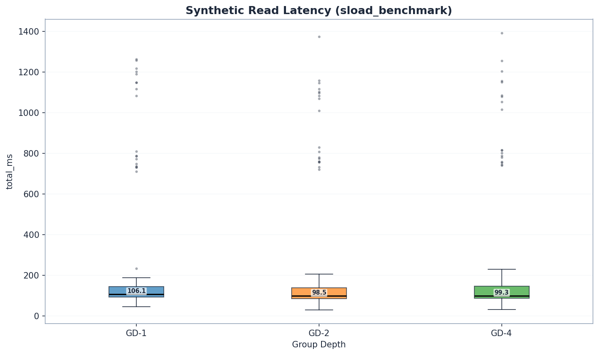
<!-- Upload: graphs-light/q1_read_latency_boxplot.png -->

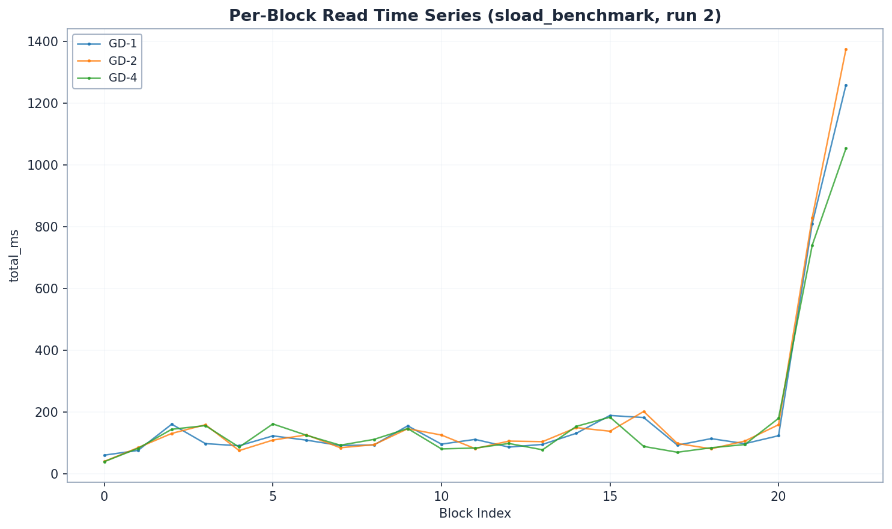
<!-- Upload: graphs-light/q1_read_timeseries.png -->

*Per-block read latency for a representative run per config, confirming stable measurements with no degradation over time.*

| Group Depth | Median Read (ms) | vs GD-1 |
|:------------|:-----------------|:--------|
| GD-1 | 53.0 | baseline |
| GD-2 | **48.0** | -9% |
| GD-4 | **47.6** | -10% |
| GD-8 | -- | no data |

Only ~10% improvement from GD-1 to GD-4. Sequential access doesn't differentiate group depths because shared prefixes keep the working set small and cache-friendly regardless of tree shape.

### ERC20 Reads: Where Depth Matters

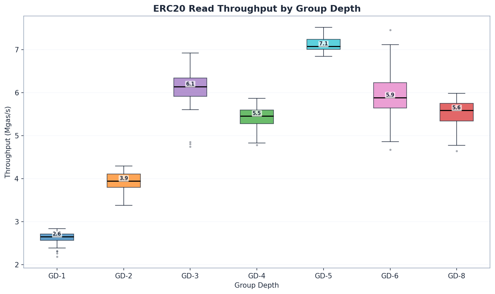
<!-- Upload: graphs-light/q4_erc20_read_boxplot.png -->

| GD | state_read (ms) | total (ms) | Mgas/s | vs GD-1 (Mgas/s) |
|:---|:----------------|:-----------|:-------|:--------|
| 1 | 5,878 | 6,284 | 2.65 | baseline |
| 2 | 3,840 | 4,230 | 3.95 | +49% |
| 3 | 2,416 | 2,768 | 6.14 | +132% |
| 4 | 2,677 | 3,067 | 5.46 | +106% |
| 5 | 4,036 | 4,742 | **7.08** | +167% |
| 6 | 2,149 | 2,581 | 5.89 | +122% |
| 8 | 2,598 | 2,977 | 5.59 | +111% |

> **3x read throughput from GD-1 to GD-5.** Throughput (Mgas/s) is the correct comparison here because GD-5 and GD-6 produced blocks with different gas amounts. By throughput, GD-5 achieves the highest read throughput (7.08 Mgas/s), followed by GD-3 (6.14 Mgas/s) and GD-6 (5.89 Mgas/s). For configs with matching block sizes (GD-1/2/3/4/8), total block time confirms the pattern: GD-3 (2,768 ms) is 10% faster than GD-4 (3,067 ms).

Why the dramatic difference from synthetic? Keccak scatters keys uniformly, forcing a full traversal from root to leaf. GD-1 must descend 256 levels; GD-8 only 32. Every level is a potential disk seek. Random access exposes the full depth penalty.

Per-slot cost: synthetic reads cost ~0.02 ms/slot. ERC20 reads cost ~0.4--1.0 ms/slot (computed as state_read_ms / storage_slots_read per block) -- a **40x penalty** from random access patterns.

> **Why random access is the baseline, not the exception.** The binary trie unifies all accounts and storage into a single tree. Every key -- whether an account balance, a storage slot, or a code chunk -- is SHA256-hashed into the 256-bit keyspace. A single contract's storage slots scatter across completely different tree paths. This makes random access the *fundamental* access pattern of the binary trie, not a pathological case. The synthetic sequential benchmarks represent an unrealistic best case that cannot occur in a unified trie deployment.

### The Cache Mechanism

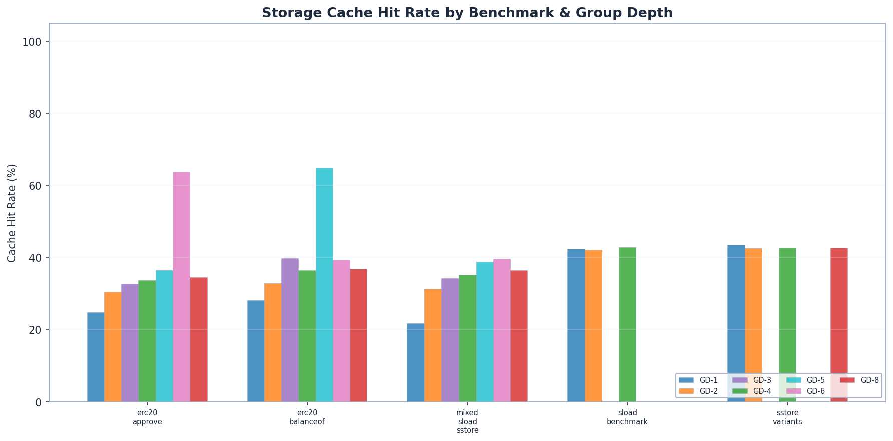
<!-- Upload: graphs-light/q7_storage_cache_hit_rates.png -->

| Benchmark | GD-1 | GD-2 | GD-3 | GD-4 | GD-5 | GD-6 | GD-8 |
|:----------|:-----|:-----|:-----|:-----|:-----|:-----|:-----|
| sstore | 43.5% | 42.5% | -- | 42.7% | -- | -- | 42.6% |
| sload | 42.4% | 42.0% | -- | 42.8% | -- | -- | -- |
| balanceOf (ERC20) | 28.0% | 32.8% | **39.7%** | 36.5% | 64.8% ⚠ | 43.8% | 36.9% |
| approve (ERC20) | 24.8% | 30.4% | 32.7% | 33.6% | 36.4% | 60.9% ⚠ | 34.5% |
| mixed (ERC20) | 21.8% | 31.4% | 34.2% | 35.2% | **38.8%** | 44.6% | 36.5% |

`balanceOf` is a read-only ERC20 function (returns a token balance). `approve` is a write operation (sets a spending allowance, modifying storage). ERC20 is the most common contract type on Ethereum mainnet, making it a representative benchmark target. The ERC20 used here is a minimal implementation -- results indicate clear trends in how group depth affects read vs write performance, though production contracts with more complex storage layouts may show variation.

Two distinct patterns emerge. Synthetic benchmarks: cache rates are flat at ~43--44% regardless of group depth -- sequential access is inherently cache-friendly. ERC20 benchmarks: cache rates **increase by 17 percentage points** from GD-1 (21--28%) to GD-4/8 (35--39%). In shallower trees, upper-level nodes are shared by many keys -- the "shared prefix" effect. But rates plateau at ~39%, as the 256-bit keyspace is too sparse for deeper cache reuse. GD-5 shows elevated cache rates on balanceof (64.8%), correlated with different block gas amounts. GD-6's balanceof and mixed cache anomalies normalized after re-running with proper cold-cache protocol (65.5%→43.8%, 63.2%→44.6%), while the approve elevation (60.9%) persists and appears structural.

*So far, wider is better. GD-8 leads on reads. Then we tested writes.*

---

## S5 -- Act II: The Write Surprise

**This is the most important finding in the study.**

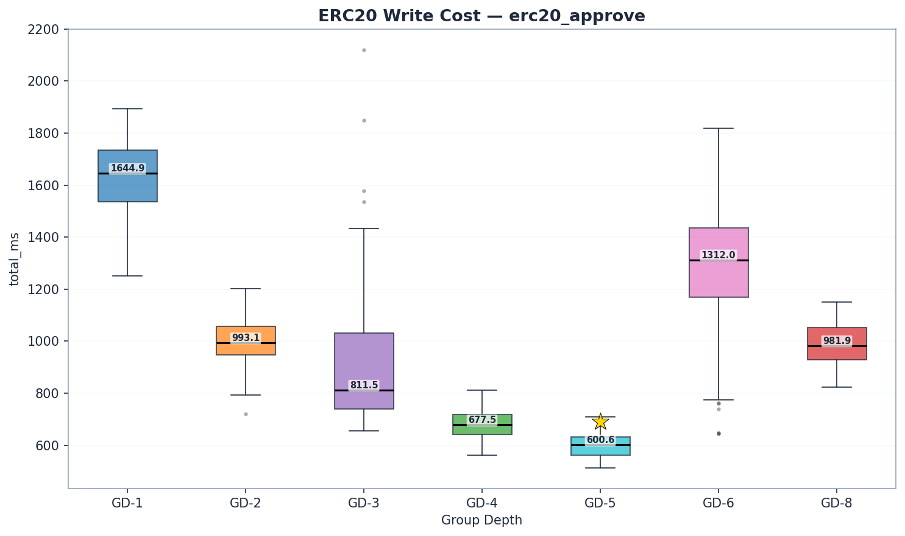
<!-- Upload: graphs-light/q5_erc20_write_boxplot.png -->

| GD | state_read | trie_updates | commit | Write Cost | Total | Mgas/s |
|:---|:-----------|:-------------|:-------|:-----------|:------|:-------|
| 1 | 812 | 690 | 76 | 762 | 1,645 | 2.67 |
| 2 | 483 | 393 | 61 | 457 | 993 | 4.42 |
| 3 | 391 | 308 | 65 | 373 | 811 | 5.39 |
| 4 | 313 | 254 | 53 | 308 | 678 | 6.47 |
| **5** | **263** | **220** | 63 | **283** | **601** | **7.30** |
| 6 | 495 | 575 | 138 | 713 | 1,312 | 6.27 |
| 8 | 313 | 433 | 158 | 603 | 982 | 4.47 |

*`trie_updates` = `state_hash_ms` (AccountHashes + AccountUpdates + StorageUpdates) — covers the full trie mutation and rehash phase, not just hashing. GD-6 was re-run with proper cold-cache protocol (OS page cache drops). CV improved from 87% to 24%, confirming reliable measurements.*

> **GD-5 is the write champion.** 601 ms total -- 11% faster than GD-4 (678 ms, p < 1e-9) and 64% faster than GD-8 (982 ms). Beyond GD-5, rehashing costs explode: GD-6 (1,312 ms) is 34% worse than GD-8, with higher hash costs (575 vs 433 ms) despite fewer internal nodes.

The component breakdown tells the story:

- **Reads:** GD-5 (263 ms) is the fastest -- 16% less than GD-4 (313 ms)
- **Trie updates:** GD-5 (220 ms) is **13% less** than GD-4 (254 ms), but GD-6 jumps to 575 ms
- **Commit:** GD-5 (63 ms) is slightly higher than GD-4 (53 ms), but GD-6 explodes to 138 ms

The total write cost for GD-5 (283 ms) beats GD-4 (308 ms) by 8%.

### Why? The Internal Subtree

Each trie node at group depth $g$ contains an internal binary subtree with $2^g - 1$ nodes that must be rehashed on every write.

<!-- Upload: diagrams/diagram_3_internal_subtree.png -->

*Figure 3 -- Each trie node contains an internal binary subtree. Wider nodes mean exponentially more hashing per write.*

- **GD-4 node:** 15 internal hash operations x 64 nodes on path = **960 total ops**
- **GD-5 node:** 31 internal hash operations x ~52 nodes on path = **~1,612 total ops**
- **GD-8 node:** 255 internal hash operations x 32 nodes on path = **8,160 total ops**

GD-5 finds the sweet spot: its path is 19% shorter than GD-4 (~52 vs 64 nodes), and each node's 31 internal operations remain manageable. At GD-6 (63 internal nodes per node), rehashing costs jump sharply -- 575 ms vs 220 ms for GD-5, confirming a clear inflection point.

> **Note:** The 17× ratio (255 vs 15 internal hash operations) is the theoretical upper bound from the data structure. Our benchmarks support the mechanism: GD-8 trie update costs are 1.71× more than GD-4 (433ms vs 254ms), consistent with random writes modifying a fraction of each node's internal subtree. The geth implementation is the authoritative source for the exact rehashing algorithm.

### Node Serialization Size

Each trie node stores up to 2^N child pointers (32 bytes each). A GD-8 node holds up to 256 × 32 = **~8 KB**. A GD-4 node: 16 × 32 = **~512 bytes**. The 16× size difference has cascading effects:

- **Pebble cache efficiency:** Fewer GD-8 nodes fit in a given cache budget
- **Write amplification:** Larger serialized nodes increase LSM compaction overhead
- **Commit cost:** The 198% commit penalty (158ms vs 53ms) partly reflects serializing 16× more data per modified node

<!-- Upload: diagrams/diagram_4_read_vs_write_path.png -->

*Figure 4 -- For reads, only the downward traversal matters (favors GD-8). For writes, rehashing and commit dominate (favors GD-4). Reads = Step 1 only. Writes = Steps 1 + 2 + 3.*

### Why Synthetic SSTORE Didn't Show This

Sequential slot access clusters writes into the same trie branch, enabling Pebble's write batch to amortize commit costs. The trie update penalty is also reduced because adjacent keys modify the same internal subtrees. The ERC20 benchmark's random access pattern defeated both amortization mechanisms.

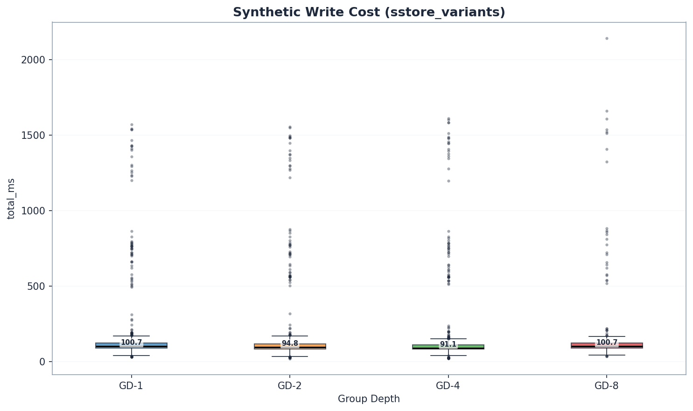
<!-- Upload: graphs-light/q2_write_cost_boxplot.png -->

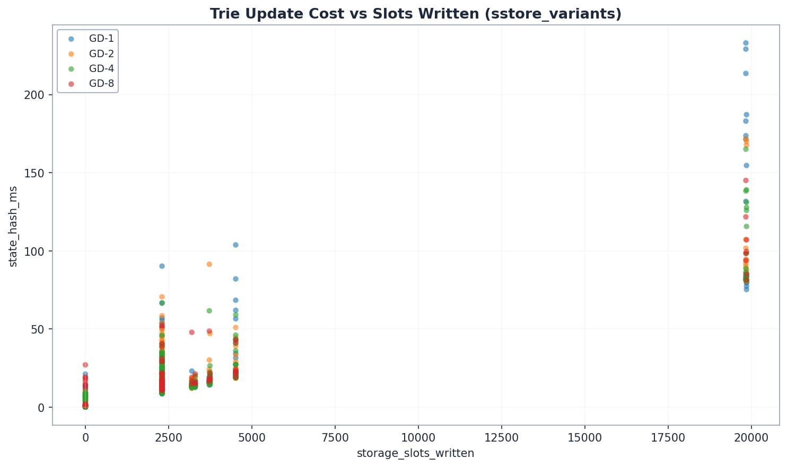
<!-- Upload: graphs-light/q2_write_scaling_scatter.png -->

*Trie update cost scales linearly with slots written. The distinct horizontal bands correspond to different sub-variants. GD-8 points (red) sit slightly above the others at each band.*

Even with sequential access, GD-8 showed a slight elevation in write cost -- a hint of the penalty that ERC20 workloads would expose fully.

---

## S6 -- Act III: The Trade-off

### The Verdict

| Criterion | GD-4 | GD-5 | GD-8 | Winner |
|:----------|:-----|:-----|:-----|:-------|
| Reads (Mgas/s) | 5.46 | **7.08** | 5.59 | **GD-5 by 30%** vs GD-4 |
| Writes (approve, ms) | 678 | **601** | 982 | **GD-5 by 11%** (p < 1e-9) |
| Mixed (ms) | 2,302 | **1,931** | 2,145 | **GD-5 by 16%** (p < 1e-3) |
| Synthetic writes | **91.6ms** | -- | 101.5ms ⚠️ | GD-4 by 10% (no GD-5 data) |

> **GD-5 wins across the board.** 11% faster writes than GD-4, 16% faster mixed workloads, and 30% higher read throughput. The write optimum lies at 5 bits per node. With corrected GD-6 data, GD-5 also wins reads (7.08 vs 5.89 Mgas/s).

### Mixed Workloads

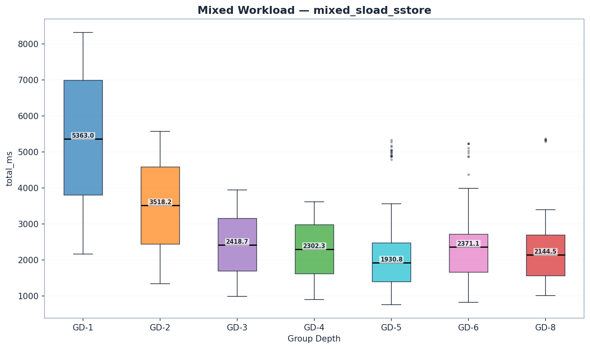
<!-- Upload: graphs-light/q6_mixed_boxplot.png -->

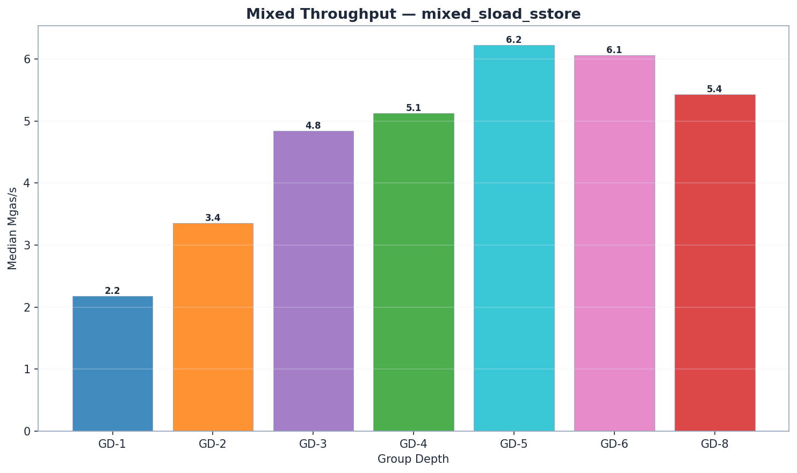
<!-- Upload: graphs-light/q6_mixed_mgas.png -->

| GD | state_read | trie_updates | commit | total_ms | Mgas/s |
|:---|:-----------|:-------------|:-------|:---------|:-------|
| 1 | 4,711 | 345 | 53 | 5,363 | 2.18 |
| 2 | 3,003 | 217 | 44 | 3,518 | 3.35 |
| 3 | 2,017 | 142 | 42 | 2,419 | 4.84 |
| 4 | 1,893 | 138 | 43 | 2,302 | 5.13 |
| **5** | **1,524** | **133** | 48 | **1,931** | **6.23** |
| 6 | 1,893 | 146 | 56 | 2,371 | 6.06 |
| 8 | 1,612 | 221 | 87 | 2,145 | 5.43 |

GD-5 wins mixed workloads decisively: 1,931 ms vs 2,302 ms for GD-4 (-16%, p < 1e-3). Its read advantage (1,524 ms state_read vs 1,893 ms for GD-4) combines with the lowest trie update cost (133 ms) to dominate. GD-6 shows moderate trie updates (146 ms) and commit (56 ms) -- the rehashing penalty is diluted in mixed workloads. GD-6's mixed penalty is driven by state_read (1,893 ms vs 1,524 ms for GD-5).

> **Open question:** The optimal group depth ultimately depends on the read/write ratio of real Ethereum blocks. While state reads clearly dominate block processing time in our benchmarks, the exact mainnet split has not been systematically measured. A historical analysis of mainnet read vs write access patterns would further inform this recommendation.

The component breakdown reveals the familiar pattern:

- **Reads:** GD-8 wins (1,612 ms vs 1,893 ms) -- shallower tree, fewer I/Os
- **Trie updates:** GD-4 wins (138 ms vs 221 ms) -- smaller internal subtrees
- **Commit:** GD-4 wins (43 ms vs 87 ms) -- less data to serialize

---

## S7 -- Cross-Cutting Patterns

### Where Does Time Go?

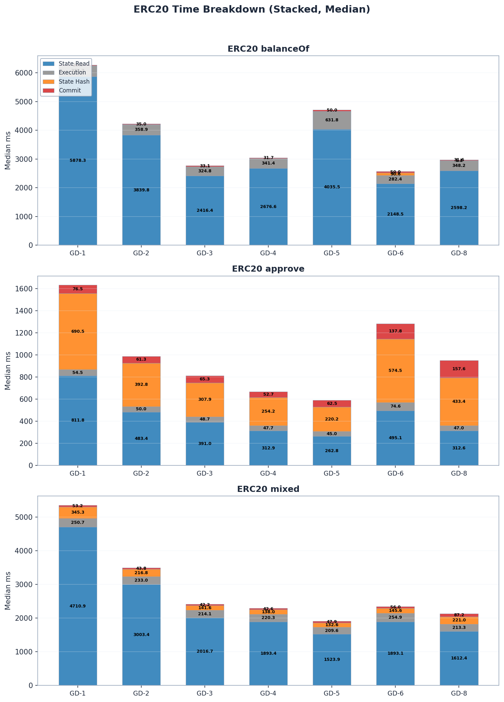
<!-- Upload: graphs-light/q3_erc20_time_breakdown_stacked.png -->

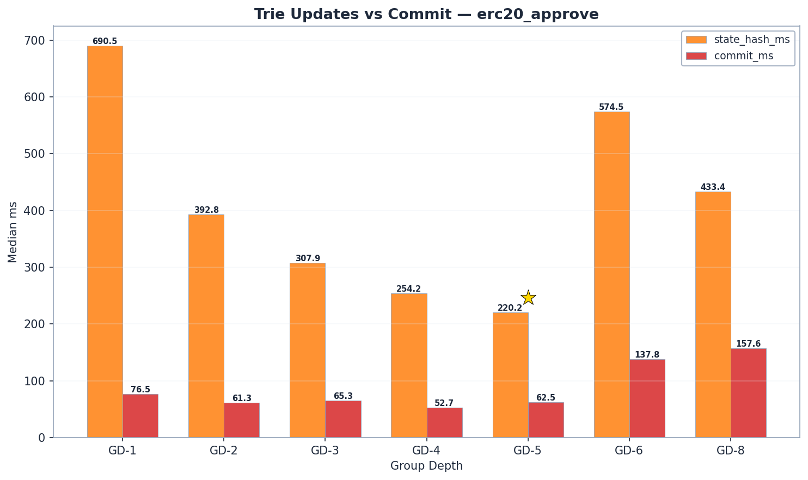
<!-- Upload: graphs-light/q3_erc20_hash_vs_commit_ratio.png -->

State reads dominate ERC20 block processing time across all group-depth configurations, accounting for 50--85% of total time. Trie update and commit costs are negligible for read-only benchmarks (balanceOf) but become the dominant cost component for writes (approve) -- especially at higher group depths where internal subtree rehashing is most expensive.

### Overall Throughput

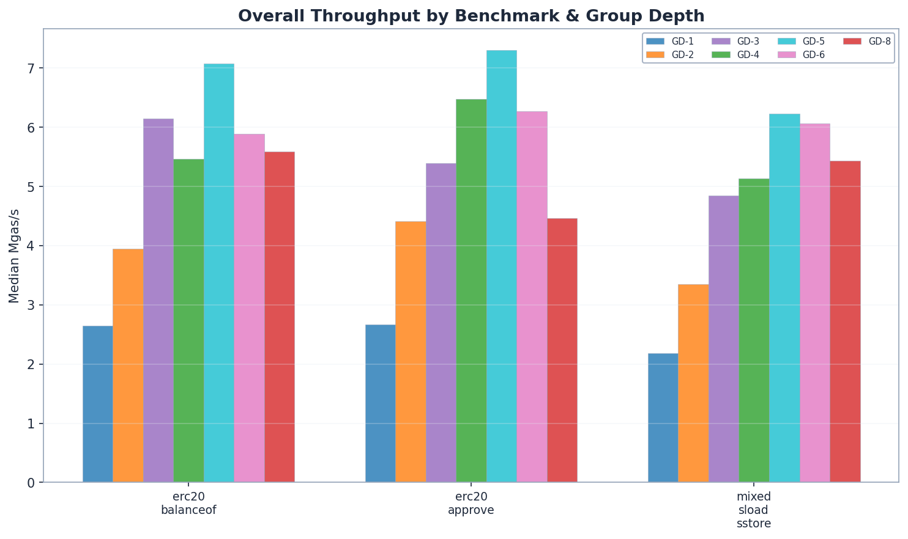
<!-- Upload: graphs-light/q8_mgas_overview.png -->

---

## S8 -- Conclusions

### Recommendation: GD-5

**GD-5 is the recommended configuration**, with high confidence for ERC20 write and mixed benchmarks. GD-5 wins writes by 11% over GD-4 (p < 1e-9) and mixed by 16% (p < 1e-3).

The recommendation rests on a three-step mechanism that governs every state access in the binary trie:

1. **Traverse** -- descend from root to leaf. Cost proportional to tree depth. Favors wider trees (GD-8: 32 levels vs GD-5: ~52 vs GD-4: 64 levels).
2. **Rehash** -- recompute the internal subtree of every node on the path back to root. Cost proportional to $2^g - 1$ per node. Favors narrower trees (GD-4: 15 ops/node, GD-5: 31 ops/node, GD-8: 255 ops/node).
3. **Commit** -- serialize and write modified nodes to disk. Cost proportional to node size. Favors narrower trees.

GD-5 finds the minimum of the traversal × rehashing trade-off. Its path is 19% shorter than GD-4 (~52 vs 64 nodes), and each node's 31 internal operations remain manageable. At GD-6, the 63 internal nodes per node cause rehashing costs to jump sharply (575 ms vs 220 ms for GD-5), producing a clear inflection point.

> **GD-8 should be considered** only if the workload is overwhelmingly read-dominated (>90% reads) and writes are rare. For typical Ethereum block processing, GD-5 is the better choice.

### On the Snapshot Layer

These benchmarks ran without a flat snapshot layer. The binary trie already performs efficient path-based reads via Pebble's BTree index -- approaching the read efficiency that MPT achieves only with a snapshot layer. Snapshots would reduce read latency differences between configs further, making the write advantage of GD-5 even more decisive.

### Five Patterns That Hold Across All Group Depths

> **Pattern 1: State reads dominate.** 50--85% of block processing time is spent reading state from disk, regardless of group depth or benchmark type. `state_read_ms` includes account and code lookups in the unified trie, not just storage slot reads.

> **Pattern 2: Random access is ~40x more expensive per slot.** Keccak-hashed keys (ERC20) cost 0.4--1.0 ms/slot vs 0.02 ms/slot for sequential access (synthetic). The gap is driven by Pebble block cache misses on keccak-scattered keys.

> **Pattern 3: Cache hit rates plateau at ~37--39%.** Despite increasing group depth, the storage cache hit rate never exceeds ~39% for keccak-hashed workloads. The 256-bit keyspace is too sparse for meaningful cache reuse beyond shared upper-level trie nodes.

> **Pattern 4: Trie updates are negligible for reads, dominant for writes.** balanceOf (pure reads): trie_updates < 1.3 ms. approve (reads + writes): trie_updates up to 690 ms. This asymmetry means the node-width trade-off only matters for write workloads.

> **Pattern 5: Run-to-run CV < 9% for original configs.** Cold-cache protocol and dedicated hardware produce reproducible results. GD-3/5 show higher variance on some benchmarks due to different block gas amounts. GD-6 was re-run with proper cold-cache protocol, reducing approve CV from 87% to 24%.

### Open Questions

1. **~~Non-power-of-2 group depths.~~ RESOLVED.** Testing GD-3, 5, 6 confirmed that **GD-5 is the new optimum** -- 11% faster writes and 16% faster mixed workloads than GD-4.

2. **Snapshot layer validation.** Empirically confirm that snapshots further favor GD-5 as our analysis predicts.

3. **Pebble block size interaction.** All tests used 4KB blocks. Larger blocks might cache wider nodes more effectively, potentially reducing GD-8's write penalty.

4. **Mainnet state distribution.** Our benchmarks use uniformly distributed random addresses. Real Ethereum state has hot spots (popular DEX contracts, bridges) that might favor different caching behavior.

5. **Concurrent block processing.** These benchmarks process blocks sequentially. Parallel execution engines might amortize trie updates across cores, reducing the per-node rehashing penalty of wider group depths.

6. **~~GD-6 data quality.~~ RESOLVED.** Re-run with proper cold-cache protocol confirmed and strengthened all GD-6 conclusions. CV dropped from 87% to 24%. Clean data revealed GD-6 writes are worse than initially measured (1,312 ms vs original 1,033 ms), now 34% worse than GD-8.

---

*Benchmarks run on the Ethereum execution-specs framework. Methodology, raw data, and reproducibility scripts available in the [execution-specs repository](https://github.com/ethereum/execution-specs).*

<!--
IMAGE UPLOAD CHECKLIST (16 images):
Diagrams:
- [ ] diagrams/diagram_1_tree_shapes.png
- [ ] diagrams/diagram_2_sequential_vs_random.png
- [ ] diagrams/diagram_3_internal_subtree.png
- [ ] diagrams/diagram_4_read_vs_write_path.png
Data Graphs (light theme):
- [ ] graphs-light/q1_read_latency_boxplot.png
- [ ] graphs-light/q1_read_timeseries.png
- [ ] graphs-light/q2_write_cost_boxplot.png
- [ ] graphs-light/q2_write_scaling_scatter.png
- [ ] graphs-light/q3_erc20_time_breakdown_stacked.png
- [ ] graphs-light/q3_erc20_hash_vs_commit_ratio.png
- [ ] graphs-light/q4_erc20_read_boxplot.png
- [ ] graphs-light/q5_erc20_write_boxplot.png
- [ ] graphs-light/q6_mixed_boxplot.png
- [ ] graphs-light/q6_mixed_mgas.png
- [ ] graphs-light/q7_storage_cache_hit_rates.png
- [ ] graphs-light/q8_mgas_overview.png
-->
